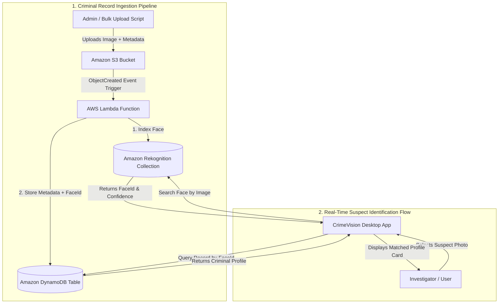
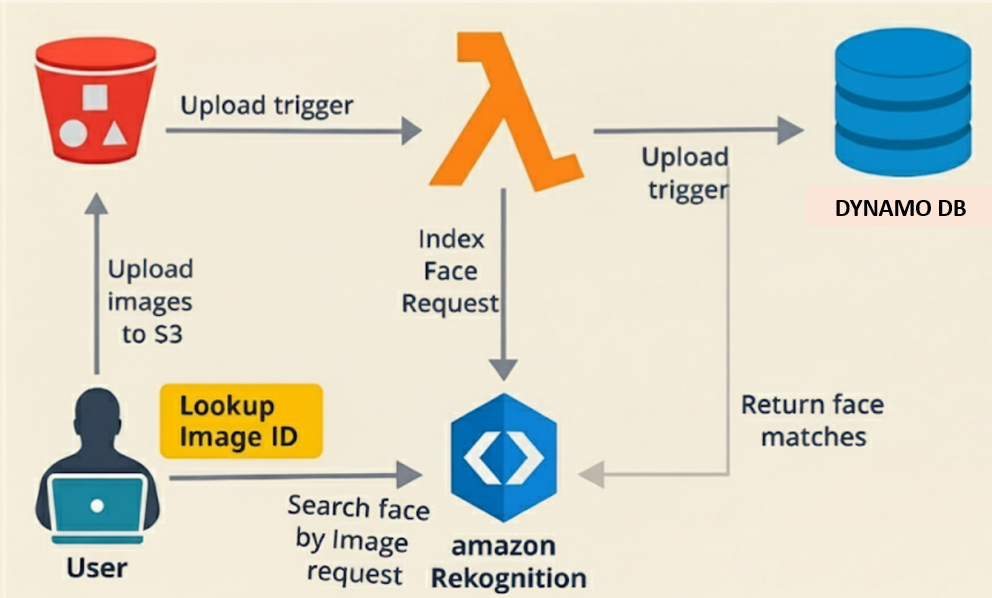

# 🕵️ CrimeVision — Intelligent Cloud-Based Criminal Identification System

[](https://www.python.org/)
[](https://aws.amazon.com/rekognition/)
[](https://aws.amazon.com/s3/)
[](https://aws.amazon.com/lambda/)
[](https://aws.amazon.com/dynamodb/)
[](LICENSE)

**CrimeVision** is an automated, serverless facial recognition and surveillance system built on Amazon Web Services (AWS) and Python. It enables law enforcement agencies and security teams to index suspect records in the cloud, match real-time or uploaded imagery with high confidence, and instantly surface criminal profiles and wanted statuses.

---

## 📌 Table of Contents

- [Overview](#-overview)
- [Key Features](#-key-features)
- [System Architecture](#-system-architecture)
- [How It Works](#-how-it-works)
- [Technologies & Cloud Services](#-technologies--cloud-services)
- [Repository Structure](#-repository-structure)
- [Prerequisites & Installation](#-prerequisites--installation)
- [Step-by-Step AWS Setup Guide](#-step-by-step-aws-setup-guide)
- [Running the Application](#-running-the-application)
- [UI Showcase](#-ui-showcase)
- [Security & Best Practices](#-security--best-practices)
- [License](#-license)

---

## 🌟 Overview

Traditional criminal identification processes rely on slow, manual photo-matching and disparate databases. **CrimeVision** streamlines this process by utilizing:
1. **Amazon S3** for secure, scalable image storage.
2. **AWS Lambda** for event-driven, automated face indexing without server management.
3. **Amazon Rekognition** for state-of-the-art deep learning facial search and biometric comparison.
4. **Amazon DynamoDB** for low-latency retrieval of criminal metadata (Name, Offense Category, Wanted Status).
5. **Modern Desktop Interface** built with Python and Tkinter for seamless image loading, asynchronous cloud querying, and visual match profiling.

---

## ✨ Key Features

- **Automated Serverless Ingestion:** Automatically indexes suspect faces when photos are uploaded to Amazon S3 with attached HTTP metadata.
- **High-Accuracy Facial Biometrics:** Leverages Amazon Rekognition face collection indexing with customizable confidence thresholds.
- **Real-Time Suspect Profiling:** Instantly retrieves criminal details (full name, crime category, wanted status) from DynamoDB.
- **Asynchronous Desktop GUI:** Modern dark-themed dashboard that stays fluid and responsive during network calls.
- **Dynamic File Picker:** Browse, preview, and test suspect photos of various formats (`.jpg`, `.jpeg`, `.png`, `.webp`).
- **Color-Coded Status Badges:** Visual indicators for 🚨 **WANTED**, 🟢 **NOT WANTED / CLEAR**, and confidence score percentages.
- **Automated Cloud Provisioning:** Includes `setup_aws.py` to create S3 buckets, Rekognition collections, and DynamoDB tables with a single command.

---

## 🏗️ System Architecture



### Architecture Diagram (ASCII View)

```text
       ┌────────────────────────────────────────────────────────┐
       │                   CRIMINAL INGESTION                   │
       └────────────────────────────────────────────────────────┘
                    │ Uploads image + metadata (S3 Put)
                    ▼
          [ Amazon S3 Bucket ] (criminal-images-bucket)
                    │
                    ▼ S3 Event Trigger
          [ AWS Lambda Function ]
                 │             │
   (Index Face)  │             │ (Save FaceId + Metadata)
                 ▼             ▼
       [ Amazon Rekognition ]  [ Amazon DynamoDB ]
       (criminal_collection)   (criminal_records)
                 ▲             ▲
   (Search Face) │             │ (Fetch Record)
                 │             │
       ┌────────────────────────────────────────────────────────┐
       │           CRIMEVISION DESKTOP APPLICATION              │
       │         (Interactive Suspect Scanner GUI)              │
       └────────────────────────────────────────────────────────┘
```

---

## 🔄 How It Works

1. **Ingestion & Indexing Phase:**
   - Criminal photos are uploaded to `s3://criminal-images-bucket/criminals/` with metadata headers (`fullname`, `crime`, `status`).
   - S3 triggers the AWS Lambda function.
   - Lambda calls `rekognition.index_faces` to generate a unique `FaceId` vectors in `criminal_collection`.
   - Lambda writes `{ RekognitionId: FaceId, FullName, CrimeType, WantedStatus }` into the `criminal_records` DynamoDB table.

2. **Identification & Verification Phase:**
   - An investigator opens the CrimeVision application and loads an unknown suspect image.
   - The app streams image bytes to `rekognition.search_faces_by_image`.
   - If a biometric match exceeds the confidence threshold (e.g. `80%+`), Rekognition returns the corresponding `FaceId`.
   - The app queries DynamoDB using `RekognitionId` and renders the subject's record on screen.

---

## 🛠️ Technologies & Cloud Services

| Layer | Technology | Purpose |
| :--- | :--- | :--- |
| **Cloud Biometrics** | [Amazon Rekognition](https://aws.amazon.com/rekognition/) | Facial detection, feature extraction, and vector matching |
| **Object Storage** | [Amazon S3](https://aws.amazon.com/s3/) | Secure cloud repository for criminal mugshots |
| **Serverless Compute**| [AWS Lambda](https://aws.amazon.com/lambda/) | Automatic background processing of uploaded photos |
| **NoSQL Database** | [Amazon DynamoDB](https://aws.amazon.com/dynamodb/) | Millisecond-latency store for suspect metadata |
| **Application Logic** | Python 3.9+ | Core scripts, AWS SDK integration, and GUI |
| **AWS SDK** | [Boto3](https://boto3.amazonaws.com/v1/documentation/api/latest/index.html) | Programmatic interface to AWS services |
| **Desktop UI** | Tkinter & Pillow (PIL) | Responsive dark-theme desktop interface |

---

## 📁 Repository Structure

```text
CrimeVision/
├── config.py                               # Centralized configuration & environment loader
├── setup_aws.py                            # Automated AWS resources provisioning script
├── BulkFacePictureUploadToS3_with_Metadata.py # Bulk image uploader with S3 metadata
├── Lambda_FaceRekognitionCode.py           # AWS Lambda trigger code (S3 -> Rekognition -> DynamoDB)
├── RunTest_FaceDetect.py                   # Modern Tkinter identification GUI application
├── app.py                                  # Application entry point launcher
├── requirements.txt                        # Python package dependencies
├── .env.example                            # Configuration environment template
├── .gitignore                              # Git ignore rules
└── README.md                               # Project documentation
```

---

## ⚡ Prerequisites & Installation

### 1. Clone the Repository
```bash
git clone https://github.com/dhanushh00/CrimeVision-Intelligent-Cloud-Based-Criminal-Identification-System.git
cd CrimeVision-Intelligent-Cloud-Based-Criminal-Identification-System
```

### 2. Set Up Virtual Environment
```bash
# Windows
python -m venv venv
venv\Scripts\activate

# Linux / macOS
python3 -m venv venv
source venv/bin/activate
```

### 3. Install Dependencies
```bash
pip install -r requirements.txt
```

### 4. Configure Environment Variables
Copy `.env.example` to `.env` (or configure via AWS CLI):
```bash
cp .env.example .env
```

Ensure AWS credentials are configured via:
```bash
aws configure
```
*(Enter your `AWS Access Key ID`, `AWS Secret Access Key`, and Default Region `us-east-1`)*.

---

## ☁️ Step-by-Step AWS Setup Guide

### Step 1: Provision Cloud Resources
Run the included setup script to automatically create the Rekognition Face Collection, DynamoDB Table, and S3 Bucket:
```bash
python setup_aws.py
```

### Step 2: Create the AWS Lambda Function
1. Open the [AWS Lambda Console](https://console.aws.amazon.com/lambda/).
2. Click **Create function** > **Author from scratch**.
   - **Function Name:** `CrimeVision-FaceIndexer`
   - **Runtime:** `Python 3.11` (or Python 3.10+)
3. In the function code editor, paste the contents of [`Lambda_FaceRekognitionCode.py`](Lambda_FaceRekognitionCode.py).
4. Click **Deploy**.

### Step 3: Grant IAM Permissions to Lambda
Attach an IAM Policy to your Lambda Execution Role allowing access to Rekognition, DynamoDB, and S3:
- `AmazonRekognitionFullAccess` (or scoped to `IndexFaces` on `criminal_collection`)
- `AmazonDynamoDBFullAccess` (or scoped to `PutItem` on `criminal_records`)
- `AmazonS3ReadOnlyAccess` (or scoped to `GetObject`, `HeadObject` on `criminal-images-bucket`)
- `AWSLambdaBasicExecutionRole`

### Step 4: Configure S3 Event Notification Trigger
1. Open the [Amazon S3 Console](https://console.aws.amazon.com/s3/) and navigate to your bucket (`criminal-images-bucket`).
2. Go to **Properties** > **Event notifications** > **Create event notification**.
   - **Event Name:** `NewCriminalImageUpload`
   - **Prefix:** `criminals/`
   - **Event types:** `All object create events` (`s3:ObjectCreated:*`)
   - **Destination:** `Lambda Function` -> Select `CrimeVision-FaceIndexer`.
3. Save changes.

---

## 🚀 Running the Application

### 1. Ingest Criminal Mugshots & Metadata
Place criminal photos in the project directory and execute:
```bash
python BulkFacePictureUploadToS3_with_Metadata.py
```
This uploads the photos with metadata headers to S3, triggering the Lambda function to index each face into the database automatically.

### 2. Launch the Desktop Scanner Application
Run the GUI application:
```bash
python app.py
# or
python RunTest_FaceDetect.py
```

1. Click **📁 Select Image** to choose a suspect photo from your computer.
2. Click **🔍 Scan & Identify** to trigger cloud facial recognition.
3. View the instant match profile, confidence meter, and wanted status alert.

---

## 🖼️ UI Showcase

| Desktop Identification Interface | AWS Rekognition Match Output |
| :---: | :---: |
|  |  |

---

## 🔒 Security & Best Practices

- **Never Commit Secrets:** Do not hardcode AWS Access Keys or Secret Keys into source code. Always use IAM roles or local AWS CLI profiles (`~/.aws/credentials`).
- **Least Privilege Access:** Scope IAM policies strictly to the specific S3 bucket, DynamoDB table, and Rekognition collection used by CrimeVision.
- **Biometric Quality Filter:** The Lambda indexing script uses `QualityFilter='AUTO'` to automatically reject blurry or low-quality mugshots.

---

## 📄 License

This project is licensed under the [MIT License](LICENSE) — see the LICENSE file for details.

---

*Developed with ❤️ by Dhanush k & contributors.*
