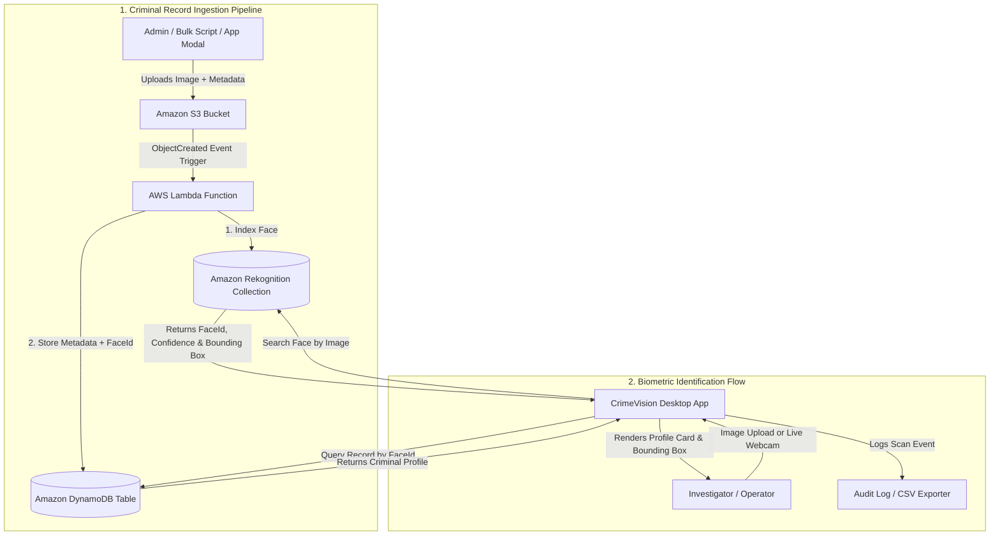

# 🕵️ CrimeVision — Intelligent Cloud-Based Criminal Identification System

[](https://www.python.org/)
[](https://aws.amazon.com/rekognition/)
[](https://aws.amazon.com/s3/)
[](https://aws.amazon.com/lambda/)
[](https://aws.amazon.com/dynamodb/)
[](https://opencv.org/)
[](LICENSE)

**CrimeVision** is an automated, serverless facial recognition and surveillance system built on Amazon Web Services (AWS), OpenCV, and Python. It enables law enforcement agencies and security teams to index suspect records in the cloud, perform real-time biometric scanning via webcam or image upload, visualize facial bounding boxes, and instantly surface criminal profiles and wanted statuses.

---

## 📌 Table of Contents

- [Overview](#-overview)
- [Key Features](#-key-features)
- [System Architecture](#-system-architecture)
- [How It Works](#-how-it-works)
- [Technologies & Cloud Services](#-technologies--cloud-services)
- [Repository Structure](#-repository-structure)
- [Prerequisites & Installation](#-prerequisites--installation)
- [Step-by-Step AWS Setup Guide](#-step-by-step-aws-setup-guide)
- [Running the Application](#-running-the-application)
  - [Live Webcam Mode](#-live-webcam-mode)
  - [Registering Suspects Directly in UI](#-registering-suspects-directly-in-ui)
  - [Offline Demo / Simulation Mode](#-offline-demo--simulation-mode)
  - [Audit Logging & CSV Export](#-audit-logging--csv-export)
- [UI Showcase](#-ui-showcase)
- [Security & Best Practices](#-security--best-practices)
- [License](#-license)

---

## 🌟 Overview

Traditional criminal identification processes rely on slow, manual photo-matching and disparate databases. **CrimeVision** modernizes this workflow by combining:
1. **Amazon S3** for secure, scalable biometric image storage.
2. **AWS Lambda** for event-driven, automated face indexing without server management.
3. **Amazon Rekognition** for state-of-the-art deep learning facial search and biometric comparison.
4. **Amazon DynamoDB** for low-latency retrieval of criminal metadata (Name, Offense Category, Wanted Status).
5. **Modern Desktop Interface** with OpenCV live camera feed, real-time bounding box annotations, suspect registration modal, and audit logs.

---

## ✨ Key Features

- **Automated Serverless Ingestion:** Automatically indexes suspect faces when photos are uploaded to Amazon S3 with attached HTTP metadata headers.
- **📷 Live Webcam Capture:** Snap suspect photos directly from your webcam with real-time video preview and alignment guides.
- **🎯 Bounding Box & Landmark Visualizer:** Overlays color-coded bounding boxes and confidence badges directly onto the suspect image.
- **➕ In-App Suspect Registration:** Direct ingestion form to upload new mugshots, input metadata, and index them into AWS Rekognition with one click.
- **🧪 Offline Demo / Simulation Mode:** Test the complete biometric scan flow and UI offline without active AWS credentials.
- **📜 Audit Log & CSV Exporter:** Comprehensive history tracking every search, timestamp, match score, and suspect status with instant CSV export.
- **High-Accuracy Facial Biometrics:** Amazon Rekognition face collection indexing with customizable confidence thresholds (default: `80%+`).
- **Color-Coded Status Badges:** Visual indicators for 🚨 **WANTED**, 🟢 **NOT WANTED / CLEAR**, and animated match confidence meters.

---

## 🏗️ System Architecture



---

## 🔄 How It Works

1. **Ingestion & Indexing Phase:**
   - Criminal photos are uploaded to `s3://criminal-images-bucket/criminals/` with metadata headers (`fullname`, `crime`, `status`).
   - S3 triggers the AWS Lambda function.
   - Lambda calls `rekognition.index_faces` to generate a unique `FaceId` in `criminal_collection`.
   - Lambda writes `{ RekognitionId: FaceId, FullName, CrimeType, WantedStatus }` into DynamoDB table `criminal_records`.

2. **Identification & Verification Phase:**
   - An investigator loads an image or captures a frame via the **Live Webcam** modal.
   - The app streams image bytes to `rekognition.search_faces_by_image`.
   - If a biometric match exceeds the confidence threshold, Rekognition returns `FaceId`, `Confidence`, and `SearchedFaceBoundingBox`.
   - The app retrieves criminal metadata from DynamoDB and draws a color-coded bounding box around the detected face.
   - The transaction is recorded in the **Audit Log**.

---

## 🛠️ Technologies & Cloud Services

| Layer | Technology | Purpose |
| :--- | :--- | :--- |
| **Cloud Biometrics** | [Amazon Rekognition](https://aws.amazon.com/rekognition/) | Facial detection, feature extraction, and vector matching |
| **Object Storage** | [Amazon S3](https://aws.amazon.com/s3/) | Secure cloud repository for criminal mugshots |
| **Serverless Compute**| [AWS Lambda](https://aws.amazon.com/lambda/) | Automatic background processing of uploaded photos |
| **NoSQL Database** | [Amazon DynamoDB](https://aws.amazon.com/dynamodb/) | Millisecond-latency store for suspect metadata |
| **Computer Vision** | [OpenCV (cv2)](https://opencv.org/) | Real-time webcam video streaming & frame capture |
| **Desktop UI** | Tkinter & Pillow (PIL) | Responsive dark-theme desktop interface & bounding box rendering |
| **Application Logic** | Python 3.9+ | Core scripts, AWS SDK integration, and GUI |
| **AWS SDK** | [Boto3](https://boto3.amazonaws.com/v1/documentation/api/latest/index.html) | Programmatic interface to AWS services |

---

## 📁 Repository Structure

```text
CrimeVision/
├── config.py                               # Centralized configuration & environment loader
├── setup_aws.py                            # Automated AWS resources provisioning script
├── BulkFacePictureUploadToS3_with_Metadata.py # Bulk image uploader with S3 metadata
├── Lambda_FaceRekognitionCode.py           # AWS Lambda trigger code (S3 -> Rekognition -> DynamoDB)
├── RunTest_FaceDetect.py                   # Advanced desktop biometric scanner GUI
├── app.py                                  # Application entry point launcher
├── requirements.txt                        # Python package dependencies
├── .env.example                            # Configuration environment template
├── .gitignore                              # Git ignore rules
└── README.md                               # Project documentation
```

---

## ⚡ Prerequisites & Installation

### 1. Clone the Repository
```bash
git clone https://github.com/dhanushh00/CrimeVision-Intelligent-Cloud-Based-Criminal-Identification-System.git
cd CrimeVision-Intelligent-Cloud-Based-Criminal-Identification-System
```

### 2. Set Up Virtual Environment
```bash
# Windows
python -m venv venv
venv\Scripts\activate

# Linux / macOS
python3 -m venv venv
source venv/bin/activate
```

### 3. Install Dependencies
```bash
pip install -r requirements.txt
```

### 4. Configure Environment Variables
Copy `.env.example` to `.env`:
```bash
cp .env.example .env
```

Configure your AWS credentials:
```bash
aws configure
```

---

## ☁️ Step-by-Step AWS Setup Guide

### Step 1: Provision Cloud Resources
Run the included setup script to automatically create the Rekognition Face Collection, DynamoDB Table, and S3 Bucket:
```bash
python setup_aws.py
```

### Step 2: Create the AWS Lambda Function
1. Open the [AWS Lambda Console](https://console.aws.amazon.com/lambda/).
2. Click **Create function** > **Author from scratch**.
   - **Function Name:** `CrimeVision-FaceIndexer`
   - **Runtime:** `Python 3.11` (or Python 3.10+)
3. Paste the contents of [`Lambda_FaceRekognitionCode.py`](Lambda_FaceRekognitionCode.py).
4. Click **Deploy**.

### Step 3: Grant IAM Permissions to Lambda
Attach the following policies to your Lambda Execution Role:
- `AmazonRekognitionFullAccess`
- `AmazonDynamoDBFullAccess`
- `AmazonS3ReadOnlyAccess`
- `AWSLambdaBasicExecutionRole`

### Step 4: Configure S3 Event Notification Trigger
1. Open the [Amazon S3 Console](https://console.aws.amazon.com/s3/) and select `criminal-images-bucket`.
2. Go to **Properties** > **Event notifications** > **Create event notification**.
   - **Prefix:** `criminals/`
   - **Event types:** `All object create events` (`s3:ObjectCreated:*`)
   - **Destination:** `Lambda Function` -> Select `CrimeVision-FaceIndexer`.
3. Save changes.

---

## 🚀 Running the Application

### 1. Launch the Desktop Scanner
```bash
python app.py
# or
python RunTest_FaceDetect.py
```

### 📷 Live Webcam Mode
1. Click **📷 Live Webcam** in the GUI.
2. Align the suspect's face inside the guided target box.
3. Click **📸 Capture Snapshot** to transfer the frame to the scanner.
4. Click **🔍 Scan & Identify**.

### ➕ Registering Suspects Directly in UI
1. Click **➕ Register Suspect** in the top navigation bar.
2. Select a photo, enter Full Name, Offense Category, and Wanted Status.
3. Click **🚀 Index & Save to Cloud** to upload to S3 and trigger automatic Lambda indexing.

### 🧪 Offline Demo / Simulation Mode
- Click the **⚡ Mode: Cloud (AWS)** button in the top bar to toggle to **🧪 Mode: Demo (Offline)**.
- Test the full biometric scanning, bounding box overlays, and identification cards with built-in mock records even without AWS credentials!

### 📜 Audit Logging & CSV Export
- Click **📜 Audit Logs** in the top bar to review past biometric scans.
- Click **💾 Export CSV Report** to save an official surveillance audit log to your computer.

---

## 🖼️ UI Showcase

| Desktop Identification Interface | AWS Rekognition Match Output |
| :---: | :---: |
|  |  |

---

## 🔒 Security & Best Practices

- **Never Commit Secrets:** Do not hardcode AWS Access Keys into source code. Always use IAM roles or local AWS CLI profiles (`~/.aws/credentials`).
- **Least Privilege Access:** Scope IAM policies strictly to the specific S3 bucket, DynamoDB table, and Rekognition collection used by CrimeVision.
- **Biometric Quality Filter:** The Lambda indexing script uses `QualityFilter='AUTO'` to automatically filter out low-quality mugshots.

---

## 📄 License

This project is licensed under the [MIT License](LICENSE) — see the LICENSE file for details.

---

*Developed with ❤️ by Dhanush k & contributors.*
